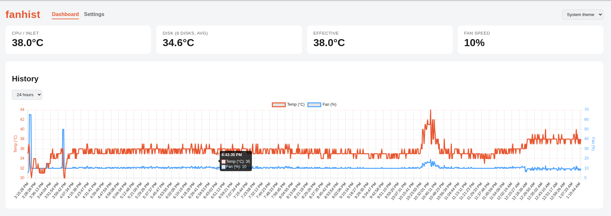
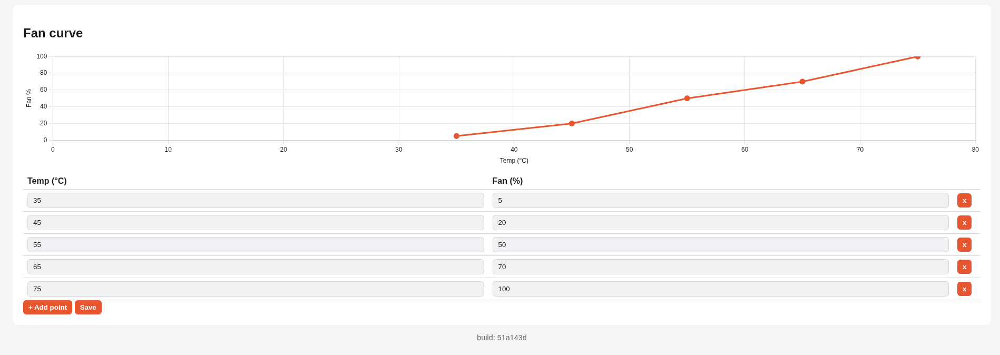
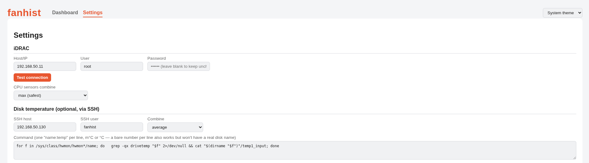
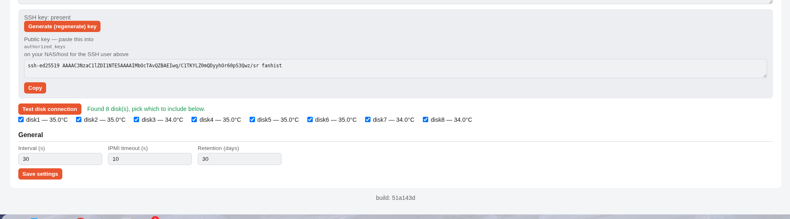

# fanhist

**fanhist** is a small, self-hosted **Dell iDRAC fan controller** for silencing loud
**PowerEdge server fan noise** — a common problem when a non-Dell (third-party) PCIe card,
HBA, or GPU makes iDRAC's automatic thermal algorithm needlessly spin every fan at 100%.
It sets a custom **temperature-to-fan-speed curve** over local **IPMI** (`ipmitool`, no
Redfish/WS-Man needed), logs history to SQLite, and is configured entirely from a small
web dashboard — no config files, no restarts. Inspired by [Hush](https://github.com/natankeddem/hush),
but built simpler and with built-in history.

**Tested on: Dell PowerEdge R720 with iDRAC 7.** See [Compatibility](#compatibility) below
for what's expected to work on other Dell generations (R610–R940, iDRAC 6/7/8) and what
won't (non-Dell BMCs like HPE iLO or Supermicro IPMI).

## Screenshots

Dashboard — live temps, fan speed, and history:



Fan curve — drag points directly on the chart, or edit the table:



Settings — iDRAC connection and sensor discovery:



Settings — per-disk temperature selection over SSH:



## ⚠️ Warning

This is a v1, built and tested against one specific environment (Dell R720, iDRAC 7). A bug
or a wrong setting could cause the fans to not ramp up (enough) under heat. Use at your own
risk, keep an eye on whether the curve does what you expect, and consider an external
temperature alert (e.g. in Home Assistant or Grafana) as an extra safety net.

## What it does

- Reads CPU/Inlet temperature directly via `ipmitool` (local IPMI, no Redfish/TLS needed —
  that turned out to be unreliably slow on older iDRAC generations like iDRAC 7)
- Optionally reads a disk temperature over SSH (e.g. TrueNAS `drivetemp`/hwmon)
- Computes the fan percentage via a configurable curve (temperature → %)
- Sets the fans via IPMI raw commands (`0x30 0x30 ...`)
- Logs every reading to SQLite and shows a graph + curve editor on a small dashboard

## Compatibility

**Sensor reading** (`ipmitool sensor list`/`sensor reading`/`sdr elist`) is standard IPMI —
it should work on any server with IPMI-over-LAN enabled, Dell or not. Sensor *names* vary by
model, which is why fanhist discovers them live via "Test connection" instead of hardcoding
any.

**Setting the fans** is the part that's vendor- and generation-specific: it uses Dell's OEM
raw IPMI commands (`0x30 0x30 0x01 ...` for manual/automatic mode, `0x30 0x30 0x02 ...` for
fan speed). These are the same commands the homelab community has used for years to fix
PowerEdge fan noise caused by non-Dell PCIe cards/HBAs/GPUs — but they're Dell-proprietary,
undocumented, and not guaranteed to behave identically across every iDRAC firmware version.

| Hardware | Expected to work? |
|---|---|
| Dell PowerEdge 10th–13th gen (iDRAC 6/7/8 — R610/R710/R715, R620/R720/R820, R630/R730/R830, etc.) | **Yes** — this is the well-established version of the trick, and what this project is actually tested against (R720 + iDRAC 7). |
| Dell PowerEdge 14th gen+ (iDRAC 9 — R640/R740/R940, R650/R750, etc.) | **No** — iDRAC 9 firmware restricts manual fan control. Raw IPMI OEM commands (`0x30 0x30`) fail with "Insufficient privilege level" errors, and RACADM tools do not support remote fan speed configuration. Sensor *reading* works fine, but automatic thermal control only. |
| Non-Dell servers (HPE iLO, Supermicro IPMI, Lenovo XCC, etc.) | **No** — the raw fan-control commands are Dell-specific. Sensor *reading* would still work over standard IPMI, but fan *control* would need different raw commands for that vendor. |

If you're on untested hardware: follow the Warning above closely, and cross-check that a
requested fan percentage actually changes real fan RPM (via the BMC's own web UI or
`ipmitool sdr type fan`) before relying on it unsupervised.

## Quick start

Every push to `main` is automatically built and published to
`ghcr.io/theeuropeanhomelab/fanhist:latest` by [a GitHub Actions workflow](.github/workflows/docker-publish.yml),
so `docker-compose.yml` just pulls the image — no need to have the source checked out on
whatever host/UI you deploy with (e.g. a stack manager that only takes a compose file).

1. Make sure IPMI over LAN is enabled on your iDRAC (iDRAC Settings → Network → IPMI Settings).
2. Start:

   ```bash
   docker compose up -d
   ```

   (Prefer building from source instead? Swap the `image:` line in `docker-compose.yml` for
   `build: .` — see the comment in that file.)

   > First run only: the GHCR package may be private by default. If the pull fails with
   > "unauthorized" or "denied", either make the package public (GitHub → your profile →
   > Packages → fanhist → Package settings → Change visibility), or add GHCR credentials
   > (a GitHub PAT with `read:packages`) wherever your Docker host authenticates registries.

3. Open `http://<host>:8181` for the dashboard.
4. Click "Settings" in the top nav and fill in your iDRAC host, user, and password, then
   click "Test connection" — this both verifies the connection and lists the available
   temperature sensors so you can check off the one(s) to use. Then click "Save settings".
5. (Optional, for disk temperature) In the same page, click "Generate key" (or
   "Regenerate key"). The public key appears immediately — paste it into `authorized_keys`
   on your NAS/host (or via the TrueNAS UI under Credentials → Users → SSH Public Key).
   Then fill in the SSH host/user, click "Test disk connection", and save.

All settings (including the iDRAC credentials and the SSH key) are stored in the SQLite
database under `./data` — so they survive a container restart or rebuild.

## Versioning

`ghcr.io/theeuropeanhomelab/fanhist:latest` always tracks the tip of `main` — convenient, but it
means a bad change can reach you immediately. Tagged releases are also published (e.g.
`ghcr.io/theeuropeanhomelab/fanhist:1.0.0`, see the [tags](https://github.com/theEuropeanHomelab/fanhist/tags)
page) if you'd rather pin to a known-good version and upgrade deliberately:

```yaml
image: ghcr.io/theeuropeanhomelab/fanhist:1.0.0   # instead of :latest
```

Also useful for checking exactly what's running: every image has the git commit baked in
via the `GIT_SHA` build arg, shown in the dashboard footer (`build: abc1234`) and at
`/api/version` — compare that against [the commit history](https://github.com/theEuropeanHomelab/fanhist/commits/main)
if you're ever unsure whether a redeploy actually picked up a new image.

## Settings

Everything is configurable from the Settings page (linked in the top nav), no environment
variables or restarts needed:

- **iDRAC**: host/IP, user, password, and one or more temperature sensors (discovered
  via "Test connection" — pick multiple if you want, e.g. Inlet + Exhaust, and how
  they're combined: average/max/min)
- **Disk temperature (optional)**: SSH host, SSH user, which disk(s) to use (discovered
  via "Test disk connection" — pick a subset if you want to exclude a boot drive, etc.),
  how they're combined (average/max/min), and the command that reads out the
  temperatures. The SSH key is generated inside the container via the "Generate key"
  button — nothing needs to be copied into the container by hand.
- **General**: measurement interval, IPMI timeout, how long history is kept

Only `DB_PATH` (where the SQLite database lives) is still an environment variable, in case
you want to put it somewhere other than the default `/data/fanhist.db`.

## Adjusting the curve

Open the dashboard, scroll to "Fan curve". Points can be dragged directly on the chart
(snapped to whole degrees/percent) or edited precisely via the table below it — either
way, click "Save" when done. The curve is linearly interpolated between points; below the
lowest point the lowest percentage applies, above the highest point the highest percentage
applies.

## Known limitations (v1)

- No authentication on the dashboard — don't expose it to the public internet.
- One iDRAC per container; run multiple instances for multiple hosts (see below).
- `DISK_TEMP_CMD` assumes Linux-hwmon-like output; adjust for other OSes.

### Multiple servers

Run a second (third, ...) instance rather than pointing one instance at multiple iDRACs —
each container is fully independent with its own settings, curve, and history. Copy
`docker-compose.yml` and change three things so it doesn't collide with the first instance:

```yaml
services:
  fanhist-server2:            # different service/container name
    image: ghcr.io/theeuropeanhomelab/fanhist:latest
    container_name: fanhist-server2
    restart: unless-stopped
    ports:
      - "8182:8081"            # different host port
    volumes:
      - ./data-server2:/data   # different data folder (its own DB + SSH key)
```

Then configure that instance's iDRAC/sensors from its own dashboard at
`http://<host>:8182`, same as the first one.

## License

MIT — see [LICENSE](LICENSE).
